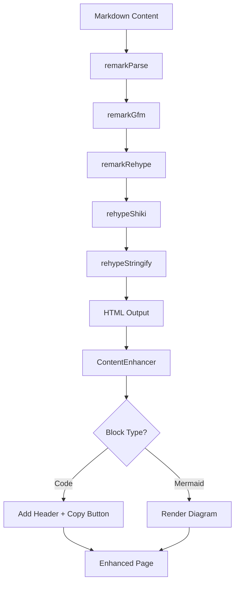
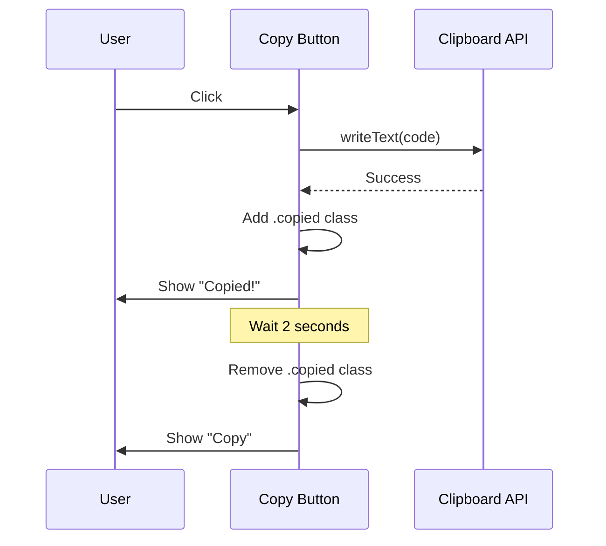

# Changelog - 2025-12-31 (#2)

## Shiki Syntax Highlighting with CodeblockWrapper Component

### Overview

Integrated Shiki syntax highlighting into the changelog pages using the `tokyo-night` theme for dark mode and `github-light` for light mode. Created a `CodeblockWrapper` component that enhances Shiki-rendered code blocks with a compact header displaying the language and a copy-to-clipboard button.

---

## Changes

### 1. Shiki Integration via @shikijs/rehype

Added `@shikijs/rehype` to the unified/remark pipeline in the changelog `[id].astro` page:

```typescript
import rehypeShiki from '@shikijs/rehype';

const processor = unified()
  .use(remarkParse)
  .use(remarkGfm)
  .use(remarkRehype, { allowDangerousHtml: true })
  .use(rehypeShiki, {
    themes: {
      light: 'github-light',
      dark: 'tokyo-night',
    },
    addLanguageClass: true,
  })
  .use(rehypeStringify, { allowDangerousHtml: true });
```

This processes markdown code blocks and outputs syntax-highlighted HTML with proper color tokens.

---

### 2. Astro Shiki Configuration

Added `shikiConfig` to `astro.config.mjs` for Astro's built-in markdown processing:

```javascript
markdown: {
  shikiConfig: {
    themes: {
      light: 'github-light',
      dark: 'tokyo-night',
    },
    wrap: true,
  },
},
```

---

### 3. Dual-Theme CSS

Added CSS to `global.css` for theme switching based on `data-mode` attribute:

```css
/* Shiki dual-theme switching for code blocks */
[data-theme="matter"][data-mode="light"] .shiki,
[data-theme="matter"][data-mode="light"] .shiki span {
  color: var(--shiki-light) !important;
  background-color: var(--shiki-light-bg) !important;
}

[data-theme="matter"][data-mode="dark"] .shiki,
[data-theme="matter"][data-mode="dark"] .shiki span {
  color: var(--shiki-dark) !important;
  background-color: var(--shiki-dark-bg) !important;
}
```

---

### 4. CodeblockWrapper Component

Created `src/components/codeblocks/CodeblockWrapper.astro` that wraps content and enhances any `<pre>` elements with:

- **Compact header** (~24px) with language label and copy button
- **Copy-to-clipboard** functionality with "Copied!" feedback
- **Language detection** from `data-language` attribute or `language-*` class
- **Matter-theme styling** using CSS variables

**Usage:**
```astro
<CodeblockWrapper>
  <div set:html={htmlContent} />
</CodeblockWrapper>
```

The wrapper uses client-side JavaScript to find and enhance code blocks after render, making it compatible with any pre-rendered HTML (including Shiki output from rehype).

---

### 5. BaseCodeblock Component

Created `src/components/codeblocks/BaseCodeblock.astro` for direct use in Astro templates:

```astro
import BaseCodeblock from '@components/codeblocks/BaseCodeblock.astro';

<BaseCodeblock code="const x = 1;" lang="typescript" />
```

Uses Astro's built-in `<Code />` component which leverages Shiki directly.

---

## Technical Details

### Theme Selection

| Theme | Mode | Aesthetic |
|-------|------|-----------|
| `tokyo-night` | Dark/Vibrant | Purple/cyan tones matching matter-theme |
| `github-light` | Light | Clean, high-contrast for readability |

### Header Design

The header is intentionally compact:
- `padding: 0.25rem 0.75rem` (vs typical `0.5rem 1rem`)
- `font-size: 0.65rem` for language label
- 12x12px copy icon
- `min-height: 1.5rem`

### Copy Button States

| State | Appearance |
|-------|------------|
| Default | 40% opacity, subtle |
| Hover | 100% opacity, light background |
| Copied | Lilac color, "Copied!" label |

---

## File Structure

```
src/components/codeblocks/
├── BaseCodeblock.astro      # Direct Astro component using <Code />
└── CodeblockWrapper.astro   # Wrapper for pre-rendered HTML content
```

---

## Dependencies

Added to `package.json`:
```json
"@shikijs/rehype": "^3.20.0"
```

---

## Usage in Changelog

The changelog `[id].astro` now:

1. Processes markdown through the unified pipeline with `rehypeShiki`
2. Wraps the output in `<CodeblockWrapper>`
3. Client-side script enhances all `<pre>` elements with header/copy UI

```astro
<CodeblockWrapper>
  <div class="entry-content prose" set:html={htmlContent} />
</CodeblockWrapper>
```

---

## Visual Result

Code blocks now display with:
- Language badge (e.g., "ASTRO", "TYPESCRIPT", "CSS")
- Copy button on the right
- Syntax highlighting with tokyo-night colors
- Smooth scrolling for long code
- Responsive design (copy label hidden on mobile)

---

## Architecture Diagram

Here's how the rendering pipeline works:



And a sequence diagram showing the copy button interaction:


