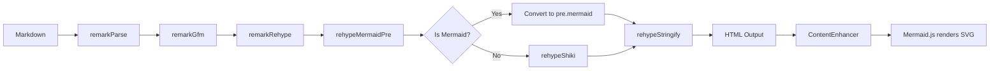

# Changelog - 2025-12-31 (#3)

## Mermaid Diagram Rendering in Markdown

### Overview

Integrated Mermaid.js diagram rendering into markdown content using the client-side JavaScript API. Created a custom `rehypeMermaidPre` plugin to prevent Shiki from syntax-highlighting mermaid code blocks, allowing Mermaid.js to render them as SVG diagrams.

---

## The Problem

When using `rehypeShiki` in the unified pipeline, ALL code blocks including ` ```mermaid ` blocks were being syntax-highlighted. This converted the raw mermaid diagram code into colored HTML tokens, preventing Mermaid.js from parsing and rendering them as diagrams.

---

## The Solution

### 1. Custom Rehype Plugin

Created `rehypeMermaidPre` - a custom rehype plugin that runs BEFORE `rehypeShiki` to extract mermaid blocks:

```typescript
import { visit } from 'unist-util-visit';

function rehypeMermaidPre() {
  return (tree: any) => {
    visit(tree, 'element', (node: any) => {
      if (
        node.tagName === 'pre' &&
        node.children?.[0]?.tagName === 'code'
      ) {
        const codeNode = node.children[0];
        const classList = codeNode.properties?.className || [];

        const isMermaid = classList.some((c: string) =>
          c === 'language-mermaid' || c === 'mermaid'
        );

        if (isMermaid) {
          const mermaidCode = codeNode.children?.[0]?.value || '';
          // Convert to <pre class="mermaid">code</pre>
          // This format won't match rehypeShiki's selector
          node.properties = { className: ['mermaid'] };
          node.children = [{ type: 'text', value: mermaidCode }];
        }
      }
    });
  };
}
```

This converts `<pre><code class="language-mermaid">...</code></pre>` to `<pre class="mermaid">...</pre>`, which Shiki won't recognize as a code block.

---

### 2. Updated Unified Pipeline

The plugin order in `[id].astro` is critical:

```typescript
const processor = unified()
  .use(remarkParse)
  .use(remarkGfm)
  .use(remarkRehype, { allowDangerousHtml: true })
  .use(rehypeMermaidPre)  // Extract mermaid BEFORE Shiki
  .use(rehypeShiki, { ... })
  .use(rehypeStringify, { allowDangerousHtml: true });
```

---

### 3. ContentEnhancer Mermaid Initialization

The `ContentEnhancer` component loads Mermaid.js from CDN and renders diagrams:

```javascript
import('https://cdn.jsdelivr.net/npm/mermaid@11/dist/mermaid.esm.min.mjs')
  .then(({ default: mermaid }) => {
    mermaid.initialize({
      startOnLoad: false,
      theme: 'dark',
      securityLevel: 'loose',
      themeVariables: { /* matter-theme colors */ },
    });

    mermaid.run({
      querySelector: '.content-enhanced pre.mermaid',
    });
  });
```

---

### 4. Bug Fix: Variable Naming Collision

Fixed a critical bug where the function name `enhanceCodeblocks()` collided with the prop variable `enhanceCodeblocks`, causing the condition `if (!enhanceCodeblocks)` to always be truthy (checking function reference instead of boolean).

**Before:**
```javascript
function enhanceCodeblocks() {
  if (!enhanceCodeblocks) return; // Always truthy!
```

**After:**
```javascript
const shouldEnhanceCodeblocks = enhanceCodeblocks;
function processCodeblocks() {
  if (!shouldEnhanceCodeblocks) return; // Correct
```

---

## Component Overview

### MermaidDiagram.astro

Direct component for embedding diagrams in Astro templates:

```astro
<MermaidDiagram>
  graph TD
    A[Start] --> B[Process]
    B --> C[End]
</MermaidDiagram>
```

### MermaidWrapper.astro

Wrapper for pre-rendered HTML content containing mermaid blocks.

### ContentEnhancer.astro

Combined wrapper that handles BOTH code block enhancement AND mermaid rendering. This is the recommended component for markdown content.

---

## Theme Variables

Mermaid is configured with matter-theme colors:

| Variable | Value | Description |
|----------|-------|-------------|
| primaryColor | #6643e2 | Main node background |
| primaryTextColor | #F9FAFB | Text on primary nodes |
| primaryBorderColor | #9C85DF | Node borders |
| lineColor | #9C85DF | Connector lines |
| background | #0F0923 | Diagram background |
| mainBkg | #1a1b26 | Node backgrounds |

---

## CSS Styling

Mermaid blocks use the same dark background as code blocks:

```css
.content-enhanced pre.mermaid {
  margin: 1.5rem 0;
  padding: 1.5rem;
  background: var(--color-surface, #111827);
  border: 1px solid var(--color-border);
  border-radius: var(--border-radius-lg, 0.5rem);
  text-align: center;
}

/* Hide raw code while rendering */
.content-enhanced pre.mermaid:not([data-processed="true"]) {
  color: transparent;
  min-height: 100px;
}
```

---

## Dependencies

Added to `package.json`:

```json
"unist-util-visit": "^5.0.0"
```

Mermaid.js is loaded from CDN at runtime (no npm dependency).

---

## Architecture Diagram


